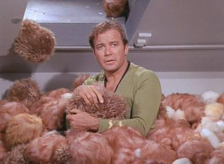
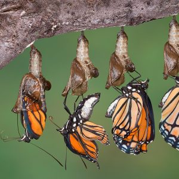

class: middle, center, middle

# R4DS Study Group: Tibbles and Transformations

<br><br>.large[Andy Murtha| MiR Study Group | 09 May 2021]

<br><br>`r icons::fontawesome("github")`.large[amurtha80]
<br><br>`r icons::fontawesome("twitter")`.large[@murtha_andy]
---
class: top, center

# Tibbles

<br><br><br><br>
---
class: top, left

# Tibbles

<br>

## What is a Tibble?

--
<br><br>

"A lazy, opinionated data frame that makes working in the tidyverse a bit easier"


<br><br><br><br><br><br>Credit: Hadley Wickam, R4DS
---
class: top, left

# Tibbles

<br>

### Attributes of a tibble

<br><br>
--
- It never changes the type of the inputs (e.g. it never converts strings to factors)
--
<br>- It never changes the names of the variables
--
<br>- It never creates row names
---
class: top, left
```{r setup, include = FALSE}
options(htmltools.dir.version = FALSE)
knitr::opts_chunk$set(
  fig.retina = 3, 
  warning = FALSE, 
  message = FALSE,
  eval = TRUE)
library(tidyverse)
library(palmerpenguins)

hook_source <- knitr::knit_hooks$get('source')
knitr::knit_hooks$set(source = function(x, options) {
  x <- stringr::str_replace(x, "^[[:blank:]]?([^*].+?)[[:blank:]]*#<<[[:blank:]]*$", "*\\1")
  hook_source(x, options)
})
```
---
class: top, left

# Tibbles

### Creating or Converting Tibbles
.pull-left[Coercing from a data frame to a tibble
```{r}
as_tibble(iris[1:5,1:2])
```
]

--

.pull-right[Creating a tibble
```{r}
tibble(
  x = 1:5, 
  y = 1, 
  z = x ^ 2 + y
)
```
]

---

# Tibbles

### Comparing Tibbles to Data Frames

<br>
--

- Printing: tibbles have a refined print method that only shows the first 10 rows, and all columns fit on the screen

--

- Printing: each column reports its data type, a nice feature borrowed from str()

--

- Subsetting: some additional tools if you want to pull out a single variable

--

- Subsetting: `$` extracts variable by name, `[[` extracts variable by name or position

--

- Subsetting: To use these in a pipe you will need to use a special placeholder `.`

---

# Tibbles

### Interacting with Older Code

<br>

--

- Some older functions don't work with tibbles. If this is the case use `as.data.frame()` to coerce the tibble to a `data.frame`

--

- The primary reason that some older functions don't work with tibble is the `[` function.

--

- With base R data frames, `[` sometimes returns a data frame, and sometimes returns a vector. With tibbles, `[` always returns another tibble

---
class: top, center

# Transformations
### (with dplyr)

<br><br>

---

# Transformations

### Goal: To get the data in exactly the correct form you need

--

* `dplyr::` verbs

--

  + `filter()` _pick observations based on their values_
  
--

  + `arrange()` _(re)order observations_
  
--

  + `select()` _choose specific variables_
  
--

  + `mutate()` _create new variables or derive variables from existing ones_
  
--

  + `summarize()` _condense many observations down to a single summary (grouped summaries)_
  
--

  + grouped `mutate()` and `filter()` _change the scope of a function from all observations in a data frame to groups of observations within a data frame_
  
---

# Transformations

### Poking around the `palmerpenguins` dataset

.center[]
---

# Transformations

#### `filter()` based on an observation's values

* What if we would like to view only observations related to the Adelie penguins on Dream Island (Antarctica)?

```{r filter, results='hide'}
penguins %>% 
  filter(species == "Chinstrap", island == "Dream") %>% #<<
  select(species:flipper_length_mm) %>% 
  slice_head(n = 5)
```

--

```{r ref.label='filter', echo=FALSE}
```
---

# Transformations

#### `arrange()` your observations based on a specific order of variable

* Which penguin species/island has the largest number of observations?
```{r arrange, results='hide'}
penguins %>%
  count(species, island, .drop = FALSE) %>%
  rename("count" = n) %>% 
  arrange(desc(count)) #<<
```

--

```{r ref.label='arrange', echo=FALSE}
```
---

# Transformations

#### `select()` the variables you want

- Allows one to focus on keeping specific variables for later use  

--

- `dplyr` package has many additional helper functions that allow you to get creative when selecting which variables you want to keep  

--

- This can allow you to create pipelines where you are fed source data, and through select only retain columns needed, even if the number of columns changed over time  

  - _assuming that your target variables always remained in tact_
  
---

# Transformations

#### `select()` the variables you want _cont'd_

* How would we go about grabbing only the variables with length or weight measurements?

--

```{r select-helper, results='hide'}
penguins %>%
  rowid_to_column("ID") %>% 
  select(ID, ends_with("_mm") | ends_with("_g")) %>% #<<
  slice_head(n = 5)
```

--

```{r ref.label='select-helper', echo=FALSE}
```

---

# Transformations

#### `mutate()` new variables or derive them from existing ones

--

- Mutate _always_ adds new columns at the end of your data frame

--

- You can create multiple new variables within the same function call

--

- You can refer to columns that you just created within the same `mutate()` function

--

- If you only want to keep the new variables that are created, use the `transmute()` function

---

# Transformations

#### `mutate()` _cont'd_

- There are many functions that you can use within `mutate()` to create new variables

--

- The key property is that the function must be vectorized:

--

  - It must take a _vector of values_ as input,
  
--

  - and return a _vector with the same number of values_ as output

---

#Transformations

#### `mutate()` _cont'd_

- More commonly used functions within `mutate()`

--

  - Arithmetic operators _(+, -, *, /, ^)_

--

  - Modular arithmetic _(%/% and %%)_

--

  - Logs _(log(), log2(), log10())_

--

  - Offsets _(lead(), lag())_

--

  - Cumulative and Rolling aggregates _(cumsum(), cumprod(), cummin(), cummax(), cummean())_

--

  - Logical comparisons _(<, <=, ==, >=, >, !=)_

--

  - Ranking _(min_rank(), row_number(), dense_rank(), percent_rank(), cume_dist(), ntile())_

---

# Transformations

#### `mutate()` examples

- Using arithmetic operators, create a _bill ratio_ between bill length and bill depth (ignoring missing values)

--

```{r mutate-arithmetic, results='hide'}
penguins %>%
  rowid_to_column("ID") %>%
  filter(!is.na(bill_length_mm) == TRUE | !is.na(bill_depth_mm) == TRUE) %>% 
  mutate(bill_ratio = bill_length_mm / bill_depth_mm, na.rm = TRUE) %>% #<<
  select(ID, contains("bill"), bill_ratio) %>% 
  slice_head(n = 5)
```

--

```{r ref.label='mutate-arithmetic', echo=FALSE}
```

---

# Transformations

#### `mutate()` examples _cont'd_

- Using the prior example and adding a ranking function, create a data frame of penguins with _bill ratios from largest to smallest_  

--

```{r mutate-rank, results='hide'}
penguins %>%
  rowid_to_column("ID") %>%
  filter(!is.na(bill_length_mm) == TRUE | !is.na(bill_depth_mm) == TRUE) %>% 
  mutate(bill_ratio = bill_length_mm / bill_depth_mm, na.rm = TRUE,
         rank = rank(desc(bill_ratio))) %>% #<<
  select(ID, contains("bill"), bill_ratio, rank) %>%
  arrange(rank) %>% 
  slice_head(n = 4)
```

--

```{r ref.label='mutate-rank', echo=FALSE}
```

---

# Transformations

#### `summarize() | summarise()` many observations into a single summary

--

- Almost always paired with a `group_by()` function, otherwise `summarize()` is not a terribly useful function

--

  - This will change the unit of analysis from the complete dataset into individual groups

--

  - If you would like to summarize a individual variable, or general info about the entire data frame (e.g. count of all observations), then a `group_by()` function is not required

--

- Accounting for missing values is important when using `summarize()`

--

  - If there are any missing values in the input, the output will be a missing value

--

- Depending on what you would like to do with the data frame after summarizing the data, `ungroup()` may be necessary

---

# Transformations

#### `summarize()` _cont'd_

- Summarizing observations from an entire data frame

--

```{r summarize-all, results='hide'}
penguins %>%
  summarize(count = n()) #<<
```

--

```{r ref.label='summarize-all', echo=FALSE}
```

---

# Transformations

#### `summarize()` _cont'd_

- Summarizing observations from groups within a data frame

--

```{r summarize-groups, results='hide'}
penguins %>%
  group_by(species) %>% 
  summarize(avg_bill_len_mm = mean(bill_length_mm, na.rm = TRUE)) %>% #<<
  arrange(desc(avg_bill_len_mm))
```

--

```{r ref.label='summarize-groups', echo=FALSE}
```

--

- <span style="color: navy;">_**Note that the missing values have been removed so the mean summary values by species are returned**_</span>
