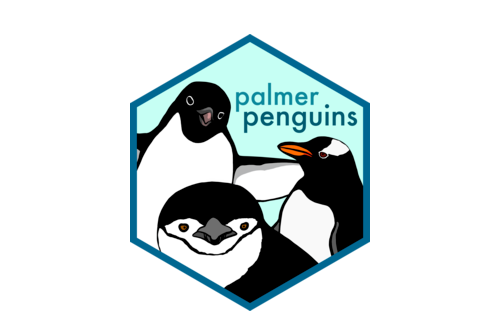

class: middle, center, middle

# R4DS Study Group: Tibbles and Transformations

<br><br>.large[Andy Murtha| MiR Study Group | 09 May 2021]

<br><br>`r icons::fontawesome("github")`.large[amurtha80]
<br><br>`r icons::fontawesome("twitter")`.large[@murtha_andy]
---
class: top, center

# Tibbles

<br><br><br><br>
---
class: top, left

# Tibbles

<br>

## What is a Tibble?

--
<br><br>

"A lazy, opinionated data frame that makes working in the tidyverse a bit easier"


<br><br><br><br><br><br>Credit: Hadley Wickam, R4DS
---
class: top, left

# Tibbles

<br>

### Attributes of a tibble

<br><br>
--
- It never changes the type of the inputs (e.g. it never converts strings to factors)
--
<br>- It never changes the names of the variables
--
<br>- It never creates row names
---
class: top, left
```{r setup, include = FALSE}
options(htmltools.dir.version = FALSE)
knitr::opts_chunk$set(
  fig.retina = 3, 
  warning = FALSE, 
  message = FALSE,
  eval = TRUE)
library(tidyverse)
library(palmerpenguins)
```
---
class: top, left

# Tibbles

### Creating or Converting Tibbles
.pull-left[Coercing from a data frame to a tibble
```{r}
as_tibble(iris[1:5,1:2])
```
]
--
.pull-right[Creating a tibble
```{r}
tibble(
  x = 1:5, 
  y = 1, 
  z = x ^ 2 + y
)
```
]
---

# Tibbles

### Comparing Tibbles to Data Frames

<br><br>
--
- Printing: tibbles have a refined print method that only shows the first 10 rows, and all columns fit on the screen
--
<br>- Printing: each column reports its data type, a nice feature borrowed from str()
--
<br>- Subsetting: some additional tools if you want to pull out a single variable
--
<br>- Subsetting: `$` extracts variable by name, `[[` extracts variable by name or position
--
<br>- Subsetting: To use these in a pipe you will need to use a special placeholder `.`
---

# Tibbles

### Interacting with Older Code

<br><br>
--
- Some older functions don't work with tibbles. If this is the case use `as.data.frame()` to coerce the tibble to a `data.frame`
--
<br>- The primary reason that some older functions don't work with tibble is the `[` function.
--
<br>- With base R data frames, `[` sometimes returns a data frame, and sometimes returns a vector. With tibbles, `[` always returns another tibble
---
class: top, center

# Transformations
### (with dplyr)

<br><br>

---

# Transformations

### Goal: To get the data in exactly the correct form you need

--
* `dplyr::` verbs
  + `filter()` _pick observations based on their values_
  + `arrange()` _(re)order observations_
  + `select()` _choose specific variables_
  + `mutate()` _create new variables or derive variables from existing ones_
  + `summarize()` _condense many observations down to a single summary (grouped summaries)_
  + grouped `mutate()` and `filter()` _change the scope of a function from all observations in a data frame to groups of observations within a data frame_
---

# Transformations

### Poking around the `palmerpenguins` dataset

.center[]
---